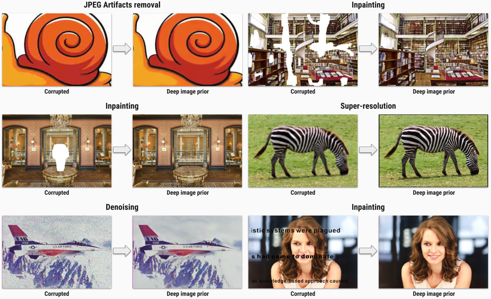

**Warning!** The optimization may not converge on some GPUs. We've personally experienced issues on Tesla V100 and P40 GPUs. When running the code, make sure you get similar results to the paper first. Easiest to check using text inpainting notebook.  Try to set double precision mode or turn off cudnn. 

# Deep image prior

In this repository we provide *Jupyter Notebooks* to reproduce each figure from the paper:

> **Deep Image Prior**

> CVPR 2018

> Dmitry Ulyanov, Andrea Vedaldi, Victor Lempitsky


[[paper]](https://sites.skoltech.ru/app/data/uploads/sites/25/2018/04/deep_image_prior.pdf) [[supmat]](https://box.skoltech.ru/index.php/s/ib52BOoV58ztuPM) [[project page]](https://dmitryulyanov.github.io/deep_image_prior)



Here we provide hyperparameters and architectures, that were used to generate the figures. Most of them are far from optimal. Do not hesitate to change them and see the effect.

We will expand this README with a list of hyperparameters and options shortly.

# Install

Here is the list of libraries you need to install to execute the code:
- python >= 3.10
- [pytorch](http://pytorch.org/)
- numpy
- scipy
- matplotlib
- scikit-image
- jupyter

All of them can be installed via `conda` (`anaconda`), e.g.
```
conda install jupyter
```


or create an conda env with all dependencies via environment file

```
conda env create -f environment.yml
```

## Apple Silicon / MPS

The notebooks now select the best available PyTorch device automatically:
CUDA first, then Apple Silicon MPS, then CPU. On macOS, install a recent
PyTorch build with MPS support and run the notebooks normally:

```
conda env create -f environment.yml
conda activate deep-image-prior
jupyter notebook
```

You can check the selected device from a notebook with:

```
device = get_device()
print(device)
```

# Command line entrypoint

Each notebook can also be run from the command line through `main.py`.
The executed notebook, run metadata, and extracted image outputs are saved under
`result/<timestamp>/<function>/`.

List available functions:

```
python main.py --list-functions
```

Run one function:

```
python main.py --function restoration
```

Override common notebook parameters:

```
python main.py --function super_resolution --input data/sr/zebra_GT.png --factor 4
python main.py --function inpainting --input data/inpainting/kate.png --mask data/inpainting/kate_mask.png
python main.py --function denoising --input data/denoising/F16_GT.png --num-iter 1000 --lr 0.01
```

For notebook-specific variables, use `--param NAME=VALUE`:

```
python main.py --function super_resolution --param imsize=-1 --param enforse_div32="'CROP'"
```

Run all notebooks:

```
python main.py --function all
```

## Docker image

Alternatively, you can use a Docker image that exposes a Jupyter Notebook with all required dependencies. To build this image ensure you have both [docker](https://www.docker.com/) and  [nvidia-docker](https://github.com/NVIDIA/nvidia-docker) installed, then run

```
nvidia-docker build -t deep-image-prior .
```

After the build you can start the container as

```
nvidia-docker run --rm -it --ipc=host -p 8888:8888 deep-image-prior
```

you will be provided an URL through which you can connect to the Jupyter notebook.

## Google Colab

To run it using Google Colab, click [here](https://colab.research.google.com/github/DmitryUlyanov/deep-image-prior) and select the notebook to run. Remember to uncomment the first cell to clone the repository into colab's environment.


# Citation
```
@article{UlyanovVL17,
    author    = {Ulyanov, Dmitry and Vedaldi, Andrea and Lempitsky, Victor},
    title     = {Deep Image Prior},
    journal   = {arXiv:1711.10925},
    year      = {2017}
}
```
